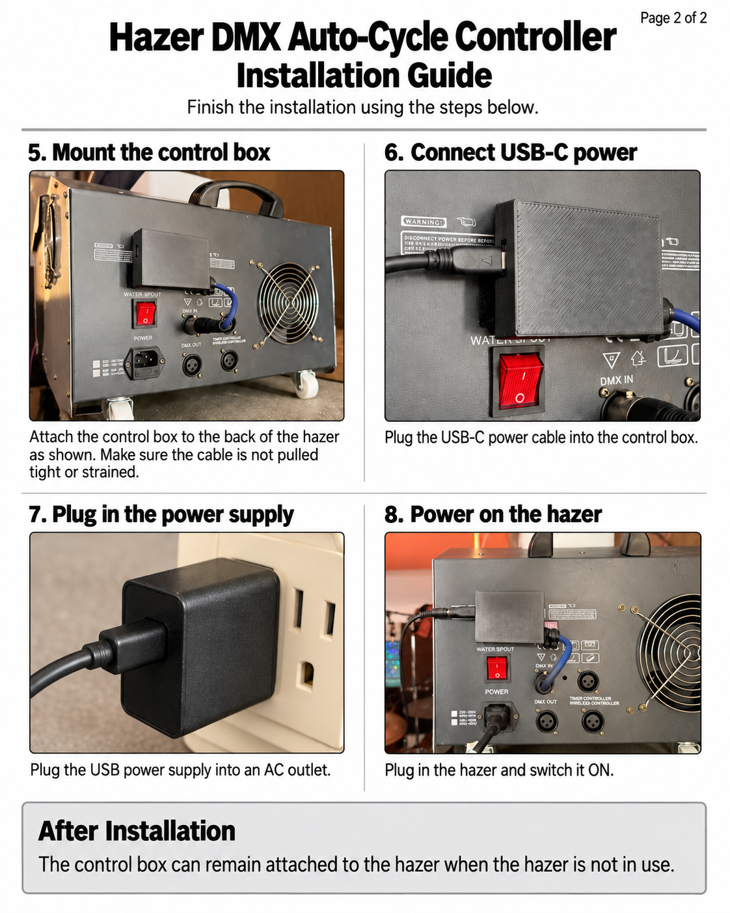
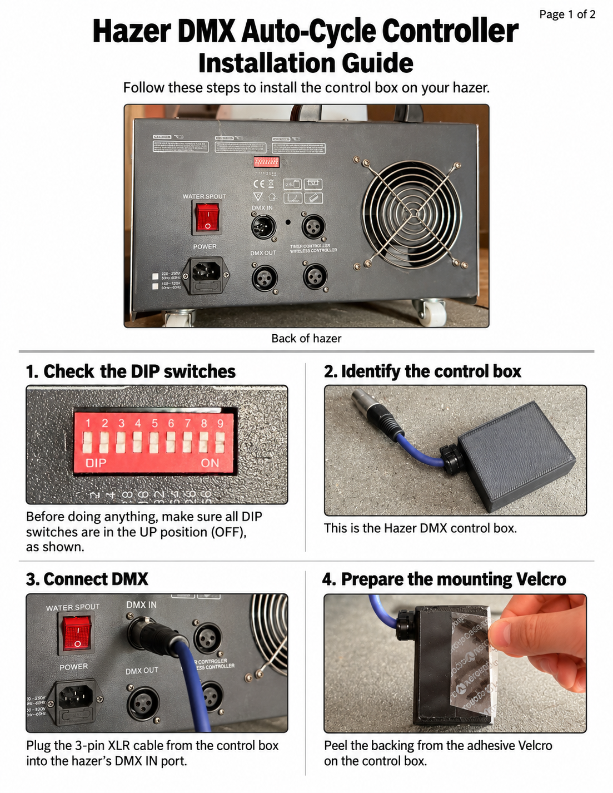

# DMX Hazer Auto-Cycle — ESP32

A standalone ESP32-based DMX controller that automatically cycles a hazer on and off without requiring a lighting console, computer, or operator.

## Why I Built This

I originally developed this controller for a haunted house installation that needed a hazer to run automatically for long periods of time.
The hazer supported DMX control, but did not have a useful standalone auto-cycle mode. Leaving a lighting console or computer running just to control a single DMX channel was unnecessary.

This project solves that problem with an ESP32 and a MAX485 module.

Once programmed and connected, operation is completely standalone:

**Power on the hazer → power on the controller → it automatically begins cycling.**

No lighting console, computer, network connection, Wi-Fi, buttons, or additional setup is required during normal operation.

Although originally designed for a haunted house, the same approach could be useful for:

- Haunted attractions
- Theatre installations
- Art installations
- Museum exhibits
- Escape rooms
- Permanent atmospheric effects
- Small events
- Any installation where a DMX device needs to repeatedly cycle without a lighting console

The firmware can easily be modified for different ON/OFF intervals and DMX output levels.

## Tested Hardware

This project was developed and tested using:

| Component | Part |
|---|---|
| Microcontroller | [ESP32 Development Board](https://a.co/d/06P1BBSm) |
| DMX / RS-485 Interface | [MAX485 Module](https://a.co/d/05upeWoA) |
| Hazer | Antari ICE-101 / compatible clone |
| DMX Connector | 3-pin XLR |

Similar hardware may work, but this is the exact ESP32 and MAX485 hardware used during development and testing.

## Default Behavior

The included firmware is configured for:

- **DMX address:** 1
- **Haze level:** 240
- **ON time:** 15 seconds
- **OFF time:** 30 seconds
- **Startup state:** OFF

After power-up, the controller waits through the initial OFF period before triggering the first haze cycle. This also gives the hazer additional warm-up time.

The cycle then repeats indefinitely:

**30 sec OFF → 15 sec ON → 30 sec OFF → 15 sec ON → ...**

## Verified Working Toolchain

The following versions were used for the tested build:

- **Arduino IDE:** 2.3.6
- **ESP32 Core:** 2.0.17 (`esp32 by Espressif Systems`)
- **esp_dmx:** 3.1.0 by Mitch Weisbrod
- **Board:** ESP32 Dev Module

> **Important:** Newer ESP32 cores and newer major versions of `esp_dmx` use different APIs and may not compile with this sketch without modification. If you simply want to reproduce the working build, use the versions listed above.

## Wiring

| Connection | To |
|---|---|
| ESP32 GPIO17 / TX2 | MAX485 DI |
| ESP32 GPIO21 | MAX485 DE + RE bridged together |
| ESP32 VIN / 5V | MAX485 VCC |
| ESP32 GND | MAX485 GND |
| MAX485 RO | Leave disconnected |
| MAX485 A | DMX XLR pin 3 / Data+ |
| MAX485 B | DMX XLR pin 2 / Data- |
| MAX485 GND | DMX XLR pin 1 / Ground |

### DMX Connector

For the tested 3-pin DMX connection:

| XLR Pin | Signal |
|---|---|
| Pin 1 | Ground / Shield |
| Pin 2 | Data- |
| Pin 3 | Data+ |

## Hazer Setup

The included firmware transmits on **DMX channel 1**.

Set the hazer to **DMX address 1**.

On the tested Antari ICE-101-compatible unit, all address DIP switches OFF corresponds to DMX address 1.

### Tested DMX Value Map

The tested hazer's Channel A responds as follows:

- `0–5` = OFF
- `6–249` = approximately 5–95% output
- `250–255` = 100% output

The included firmware uses:

```cpp
const uint8_t FOG_LEVEL = 240;
```
---

## Installation Guide

Once the controller is assembled and programmed, installation is simple. The controller can remain mounted to the hazer between uses.





---

Designed by Jesse @ freejoy.club.
